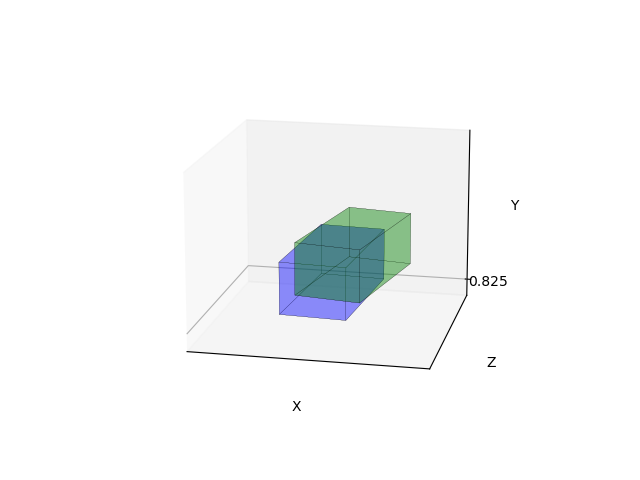
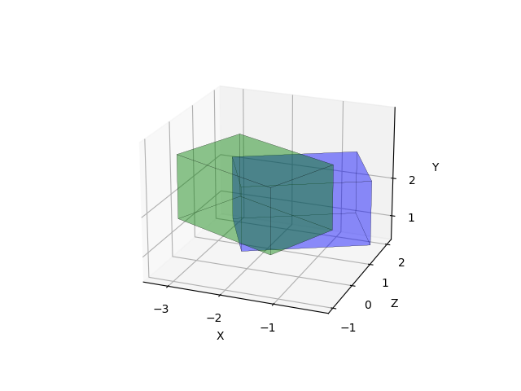

# IoU 3D for Bounding Boxes.

This code presents a simple way to score the Intersection over Union 3D of 2 boxes. It takes into account all
dimensions. To compare, the code prints the IoU 3D and 2D (Bird-eye-View).

Furthermore, the program plots the boxes using a well-known python package (Matplotlib). In this way, it is possible
to rotate, zoom out and zoom in the boxes presented in the scene.

OBS: If you want to plot a list of boxes, implement a "for" operation in *plotingcubes* function in Z1 and Z2.
Example:
```
for Z1 in Boxes1:
    verts1 = [[Z1[0], Z1[1], Z1[2], Z1[3]],
                  [Z1[4], Z1[5], Z1[6], Z1[7]],
                  [Z1[0], Z1[1], Z1[5], Z1[4]],
                  [Z1[2], Z1[3], Z1[7], Z1[6]],
                  [Z1[1], Z1[2], Z1[6], Z1[5]],
                  [Z1[4], Z1[7], Z1[3], Z1[0]]]
    ax.add_collection3d(Poly3DCollection(verts1, facecolors='blue', linewidths=0.1, edgecolors='black', alpha=.25))
```

## Requirements
```
numpy
matplotlib
```
## Exemples

### Below there are 2 examples of the code result.
##### Example 1 : IoU 3D: 0.2769   IoU 2D: 0.5169


##### Example 2 : IoU 3D: 0.1423   IoU 2D: 0.2434

